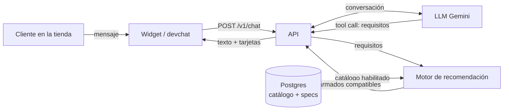

# Asesor de armado de PC para Tiendanube

Un asistente conversacional que recomienda una PC de escritorio **completa, compatible y con stock real** dentro de una tienda de informática en Tiendanube. El cliente escribe lo que necesita ("quiero jugar Valorant y LoL, tengo un millón y medio") y recibe hasta tres armados listos para agregar al carrito o consultar por WhatsApp.

> Estado: en desarrollo. El núcleo (base de datos, motor de compatibilidad y recomendación, API de chat con LLM y cliente reutilizable) funciona de punta a punta en local con un catálogo de prueba. La integración con Tiendanube y el despliegue en la nube son las próximas etapas.

## El problema

En una tienda chica de informática, la mayoría de las consultas de armado vienen de gente que no sabe de hardware: no conoce sockets, tipos de memoria ni consumos, y tampoco sabe qué necesita para lo que quiere hacer. Esas consultas llegan por WhatsApp o al mostrador y consumen tiempo del negocio.

Los "armadores de PC" de las tiendas grandes resuelven la compatibilidad, pero asumen que el cliente ya sabe qué elegir. Este proyecto apunta al otro lado: que el cliente describa su uso y su presupuesto con sus palabras, y que el sistema haga el resto sin recomendar nada que no exista en el local.

## Cómo funciona



La idea central del diseño es **separar lo que hace bien un LLM de lo que tiene que ser exacto**:

- **El LLM conversa.** Entiende "juegos livianos", "lo uso para la facu" o "me puedo estirar un poco", y los traduce a requisitos estructurados mediante una herramienta (`recommend_builds`).
- **El motor decide.** Un código determinístico y testeado elige las piezas, verifica la compatibilidad (socket, memoria, formato, largo de placa de video, potencia de la fuente…) y respeta el stock y el presupuesto. El LLM nunca elige productos ni decide si algo es compatible.
- **El código verifica lo que el LLM escribe.** Los precios que menciona se controlan contra los totales reales, y el formato se limpia antes de llegar al cliente.

## Lo técnicamente interesante

- **Motor de compatibilidad y recomendación puro.** Enumeración exhaustiva con poda sobre el catálogo, perfiles de uso con pesos, tres niveles de armado (lo que obtenés gastando 70 %, 85 % y 100 % del presupuesto) y reglas como "si el armado tiene placa de video, la fuente tiene que estar certificada". Probado con tests de propiedades (`fast-check`): cientos de pedidos aleatorios en los que cada armado devuelto tiene que ser compatible, entrar en el presupuesto y respetar el stock.
- **Guardas sobre el LLM.** Un *money guard* extrae los montos de cada respuesta y la reemplaza si aparece uno que no corresponde a ningún armado real. Lo agregamos después de ver al modelo inventar precios en una prueba real.
- **Resiliencia ante un proveedor inestable.** Reintentos solo ante fallas rápidas, salto directo a un modelo de respaldo ante timeouts y un presupuesto de tiempo total por llamada.
- **Integridad en la base.** Postgres con restricciones que hacen imposibles ciertos errores: una clave foránea compuesta impide cargar especificaciones de procesador en un componente que es una placa de video, y un CHECK impide habilitar en el asesor un producto sin vincular.
- **Datos reales desordenados.** El catálogo viene de un export CSV de Tiendanube en windows‑1252, con nombres no estandarizados, SKUs repetidos y productos mal categorizados. El modelo de datos separa el catálogo global de componentes de los productos de cada tienda, lo que deja abierta la puerta a varias tiendas.
- **Desarrollado dirigiendo agentes de IA.** El diseño, las especificaciones y las revisiones son míos (con asistencia de Claude como arquitecto); la implementación la hicieron agentes de Gemini en Antigravity. El proceso y sus reglas están definidos en [AGENTS.md](AGENTS.md).

## Stack

TypeScript en todo el monorepo (pnpm workspaces) · zod para los contratos · Postgres (PGlite en desarrollo y tests, Neon en producción) con Drizzle y migraciones SQL escritas a mano · Hono para la API · Gemini mediante `@google/genai`, detrás de una interfaz propia · Vitest y fast-check · Vite para la página de prueba. Planificado: Google Cloud Run y NubeSDK de Tiendanube.

## Estructura

```
packages/shared          Contratos (esquemas zod) y tipos compartidos
packages/db              Migraciones SQL, importador CSV, repositorios
packages/engine          Compatibilidad y recomendación (puro, sin IO)
packages/advisor-client  Lógica del cliente sin DOM, reutilizable en el widget
apps/api                 API HTTP + orquestación del LLM
apps/devchat             Página local para probar el chat
docs/                    Setup local, comandos y desarrollo
```

## Probarlo en local

Requiere Node 22 y Corepack. El detalle está en [docs/desarrollo.md](docs/desarrollo.md).

```bash
corepack enable
pnpm install
pnpm check                      # build + todos los tests

# cargar la tienda de prueba
pnpm --filter @pcadvisor/db db:migrate
pnpm --filter @pcadvisor/db import:csv --store 900000001 --name "Tienda Demo" --file seed/demo/tiendanube-demo.csv
pnpm --filter @pcadvisor/db seed:components --file seed/demo/components.json
pnpm --filter @pcadvisor/db apply:mappings --store 900000001 --file seed/demo/mappings.json

# copiar apps/api/.env.example a apps/api/.env y completar la API key de Gemini
pnpm --filter @pcadvisor/api dev
pnpm --filter @pcadvisor/devchat dev     # http://localhost:5173
```

## Documentación

El detalle de configuración, comandos y convenciones para levantar y probar el proyecto en local está en [docs/desarrollo.md](docs/desarrollo.md).

## Hoja de ruta

1. **Evaluación del LLM** con frases reales de clientes: medir extracción de requisitos, respeto de reglas y latencia, y comparar prompts, modelos y proveedores.
2. **App de Tiendanube**: instalación, sincronización del catálogo por API y panel para vincular productos con componentes.
3. **Widget en la tienda** con NubeSDK, reutilizando `advisor-client`.
4. **Despliegue** en Cloud Run con Neon.
5. Después: coolers y periféricos, reglas comerciales y un modo para el empleado en el mostrador.
