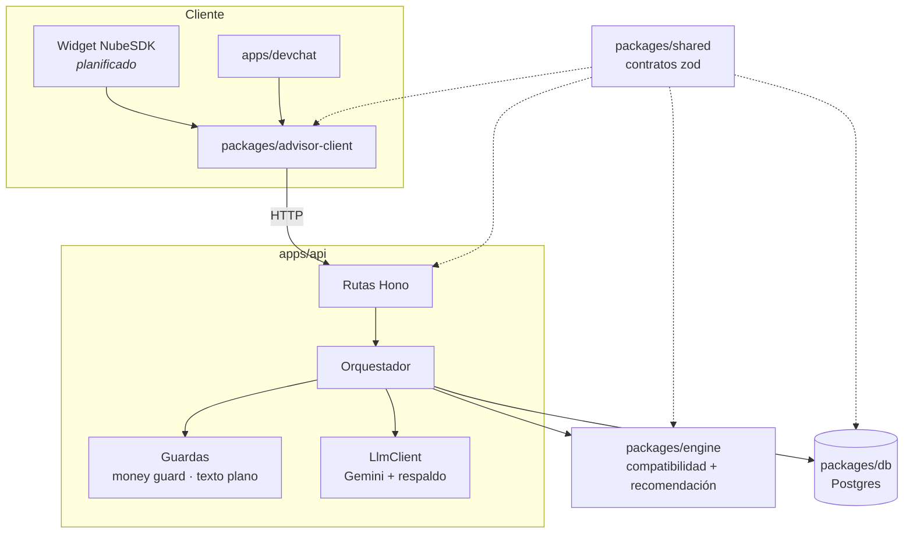
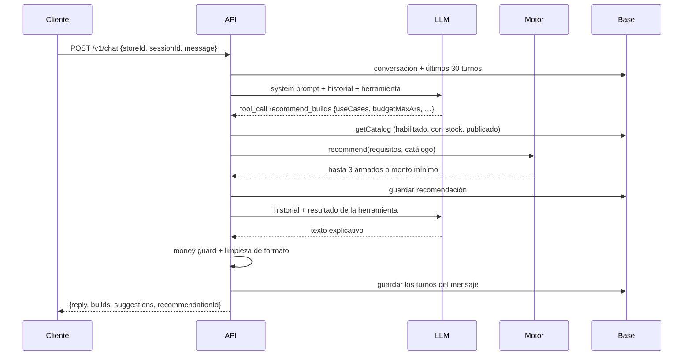
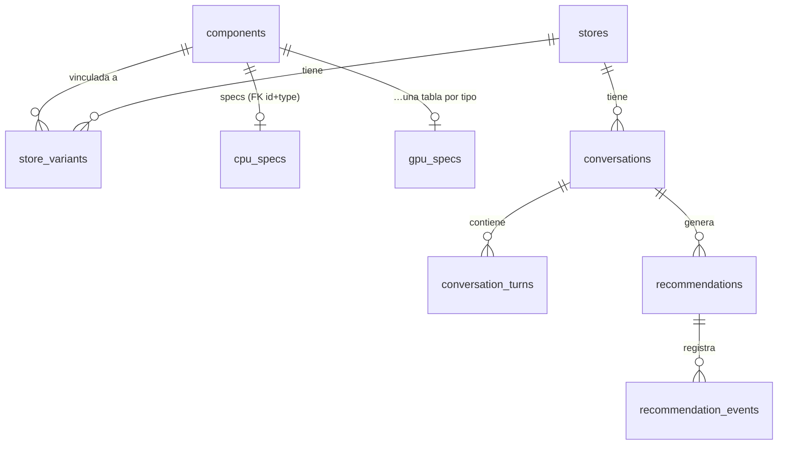

# Arquitectura

## Visión general

El sistema tiene tres responsabilidades bien separadas: **conversar** con el cliente (LLM), **decidir** qué PC recomendar (motor determinístico) y **guardar** el catálogo y las conversaciones (Postgres). La API las coordina.

## Paquetes y dependencias

| Paquete | Responsabilidad | Depende de |
|---|---|---|
| `shared` | Esquemas zod y tipos: el contrato entre todas las piezas | — |
| `engine` | Compatibilidad y recomendación. Puro: sin IO, sin fechas, sin azar | shared |
| `db` | Migraciones, importación, repositorios, `getCatalog` | shared |
| `advisor-client` | Llamadas a la API, estado del chat y presentación, sin DOM | shared |
| `apps/api` | HTTP, orquestación del LLM, guardas | todos |
| `apps/devchat` | Interfaz de prueba local | advisor-client |

Dos reglas sostienen esta estructura. `engine` nunca importa `db`: el motor recibe un catálogo ya armado y por eso se prueba sin base de datos. Y `advisor-client` tiene prohibido usar `window`, `document` o `localStorage` (un test lo verifica), porque el widget final corre dentro de un Web Worker de NubeSDK, donde nada de eso existe.

Los paquetes se consumen por sus tipos compilados (`dist/`). Por eso el comando de verificación es siempre `pnpm check`, que compila antes de testear.

## Flujo de un mensaje

Algunos detalles importantes:

- El LLM puede llamar a la herramienta **como máximo dos veces por mensaje**. Si pide una tercera, se responde con un texto fijo.
- El LLM recibe un resumen de cada armado (procesador, placa de video, GB de RAM y de disco, advertencias y el total ya formateado), nunca los datos crudos. Las tarjetas que ve el cliente se arman con los datos del motor, no con lo que escribe el LLM.
- Todos los turnos de un mensaje se guardan juntos al final. Si el LLM falla a mitad de camino, no queda una conversación a medio escribir.

## Modelo de datos

La separación clave es entre **componentes** y **variantes de tienda**:

- `components` es un catálogo global: "AMD Ryzen 5 5600GT" existe una sola vez, con sus especificaciones técnicas en la tabla de su tipo (`cpu_specs`, `motherboard_specs`, etc.).
- `store_variants` son los productos tal como existen en una tienda, con su nombre comercial ("Procesador AMD Ryzen 5 5600GT AM4 65W 3.6GHZ 6 CORE"), precio y stock. Se vinculan con un componente, y una persona confirma ese vínculo.

Un producto entra al asesor solo si está **vinculado, confirmado y habilitado**. Ese mismo mecanismo deja afuera los productos mal categorizados (una fuente de 12 V para cámaras dentro de "Componentes") y los que tienen el stock dudoso.

Algunas restricciones que vale la pena mirar en `packages/db/migrations/`:

- Cada tabla de especificaciones referencia a `components` con la clave compuesta `(component_id, type)`, y tiene un CHECK sobre el tipo. La base impide guardar especificaciones de CPU en un componente que es una GPU.
- `store_variants` no permite `advisor_enabled = true` si el vínculo no está confirmado.
- El SKU **no** es único, porque en los datos reales hay SKUs repetidos. La identidad es el ID de variante de Tiendanube.
- `conversation_turns` guarda cada turno como JSON, con un CHECK que asegura que el rol del JSON coincida con la columna.

Las migraciones son archivos SQL escritos a mano. Se aplican en una transacción por archivo, con la API de transacciones del driver, y nunca se editan una vez aplicadas.

## Motor

`checkCompatibility(parts)` valida en dos fases. La primera es estructural: falta una pieza obligatoria, hay dos procesadores, hay una fuente de más. Si falla, corta ahí. La segunda aplica todas las reglas técnicas y acumula todas las violaciones, con mensajes en español que incluyen los valores concretos.

`recommend(requisitos, catálogo)`:

1. Resuelve un **perfil** según los usos: pesos de CPU, GPU, RAM y almacenamiento, y una política de GPU (obligatoria, opcional o evitada).
2. Recorre las combinaciones (procesador → mother → RAM → gabinete → disco → placa de video → fuente) y **poda** apenas una rama es incompatible o se pasa del tope.
3. Para cada tope (70 %, 85 % y 100 % del presupuesto, o 110 % si es flexible) se queda con el mejor candidato según un único criterio de orden: puntaje, después precio, después id.
4. Verifica los armados elegidos con `checkCompatibility` y lanza un error si alguno falla. Ese error indicaría un bug en la poda, y no se oculta.
5. Si nada entra en el presupuesto, devuelve el precio del armado válido más barato, para que el chat pueda decir desde cuánto arranca.

Con el catálogo de prueba (unas 160.000 combinaciones válidas) tarda alrededor de 100 ms en una notebook.

## Despliegue (planificado)

API en Google Cloud Run (escala a cero), Postgres en Neon y Cloud Scheduler para sincronizar el catálogo. Las migraciones van a correr como un paso separado del despliegue, no al arrancar la API: con varias instancias levantándose a la vez, migrar al iniciar haría que compitan entre sí.
