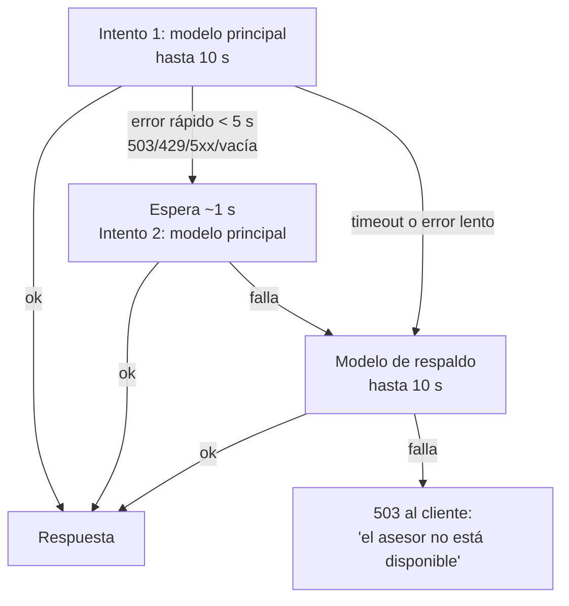

# Diseño de la integración con el LLM

Un LLM es bueno para entender lenguaje informal y malo para garantizar cualquier cosa. Este documento describe cómo se aprovecha lo primero sin depender de lo segundo.

## Principio

**Todo lo que se puede verificar con código, se verifica con código.** Al LLM le quedan dos tareas: entender qué quiere el cliente y explicar el resultado en lenguaje simple. La compatibilidad, la selección de piezas, el stock, los precios y el formato los resuelve o los controla el código.

## La herramienta `recommend_builds`

El LLM no recibe el catálogo. Recibe una sola herramienta:

| Argumento | Tipo | Notas |
|---|---|---|
| `useCases` | lista de `gaming`, `office`, `study`, `design`, `video_editing`, `programming` | Los valores salen de los esquemas compartidos, no se copian a mano |
| `budgetMaxArs` | entero en pesos | El código lo convierte a centavos |
| `budgetFlexible` | booleano | Si es true, el tope sube al 110 % |
| `gamingResolution` | `1080p`, `1440p`, `4k` | Opcional |
| `gamingDemand` | `light`, `demanding` | Opcional; define si la placa de video es obligatoria |
| `preferences` | marca de CPU o GPU, placa de video dedicada | Opcional |

Los argumentos se validan con zod. Si no validan, el LLM recibe `invalid_args` con la lista de errores y puede corregirse.

El resultado tiene tres formas posibles:

```jsonc
{ "status": "ok", "builds": [
    { "tier": "balanced", "cpu": "Procesador AMD Ryzen 5 5600GT …", "gpu": null,
      "ramGb": 16, "storageGb": 500, "storageType": "nvme",
      "warnings": ["Usa los gráficos integrados del procesador: …"],
      "totalLabel": "$ 1.494.767" } ] }

{ "status": "no_builds_in_budget", "minimumBudgetLabel": "$ 1.165.231", "minimumBudgetArs": 1165231 }

{ "status": "invalid_args", "issues": ["budgetMaxArs: Number must be greater than 0"] }
```

Lo que el LLM **nunca** recibe: precios en centavos, IDs internos ni notas internas del local.

## El prompt

El *system prompt* (`apps/api/src/chat/prompt.ts`) define el comportamiento del producto. Por eso lo escribe quien diseña el sistema, no un agente que implementa. Sus reglas principales:

- Hablar en español rioplatense, en texto plano y sin markdown.
- Con uso y presupuesto, llamar a la herramienta de inmediato. Si falta uno de los dos, preguntar solo eso.
- Clasificar los juegos en livianos o exigentes a partir de ejemplos concretos.
- Sobre dinero, escribir solo el presupuesto del cliente o los montos que devuelve la herramienta, copiados exactamente.
- No minimizar las advertencias ni exagerar el rendimiento.
- No hablar del BIOS ni de detalles técnicos del armado, porque el local arma la PC.
- Si el cliente acepta el presupuesto mínimo, volver a buscar con ese monto exacto.

Una lección importante: **las reglas del prompt son sugerencias fuertes, no garantías.** Los modelos chicos siguen peor las instrucciones negativas ("no digas X") que las positivas. Por eso cada regla crítica tiene además un control en el código.

## Guardas en el código

**Money guard** (`chat/money-guard.ts`). Extrae los montos de la respuesta y los compara con los permitidos: los totales devueltos por la herramienta, el mínimo y los montos que escribió el cliente. Si aparece uno que no está permitido, la respuesta se reemplaza por un texto seguro que remite a las tarjetas, y el incidente queda registrado (solo los montos, nunca el texto).

El detalle difícil es distinguir un precio de un nombre de modelo: "i5‑12400F" tiene cinco dígitos, pero no es un precio. Por eso solo cuentan como monto los números con `$`, los que tienen separador de miles y los de seis o más dígitos que no tienen una letra pegada.

**Texto plano** (`chat/plain-text.ts`). Quita las marcas de markdown que la interfaz no interpreta: negritas, itálicas, títulos y código. Las itálicas se detectan con una regla que no toca expresiones como `2*3*4` ni los ítems de lista.

**Límites.** Máximo dos llamadas a la herramienta por mensaje y un límite de mensajes por conversación.

**Persistencia coherente.** Si el money guard reemplaza una respuesta, se guarda la versión reemplazada. Si se guardara la original, en el mensaje siguiente el modelo vería su propio precio inventado y lo defendería.

## Resiliencia

El plan gratuito de Gemini devuelve a veces errores 503 ("alta demanda") o tarda más de lo razonable. El cliente LLM (`llm/gemini.ts`) maneja eso así:



- Presupuesto total de 25 segundos por llamada, con tiempo reservado para el respaldo.
- Un error 400 no se reintenta: indica un problema en el pedido, y reintentar no lo arregla.
- Reintentar es seguro porque `generate()` no tiene efectos secundarios.
- Cada intento queda registrado (`llm_attempt`, con el modelo, la duración, el resultado y los *tokens*), así que se puede ver cuándo actuó cada mecanismo.

## Proveedor intercambiable

Todo pasa por una interfaz:

```ts
interface LlmClient {
  generate(input: { system: string; history: ChatTurn[]; tools: ToolSpec[] }): Promise<LlmOutput>;
}
```

El historial se guarda en un formato propio. El adaptador de Gemini lo traduce y reenvía sin cambios los datos internos del modelo (`providerData`, con las *thought signatures*). En los tests se usa un `FakeLlmClient` con respuestas preparadas: ningún test depende de la red. El modelo real se prueba con un script aparte (`pnpm --filter @pcadvisor/api smoke`).

## Privacidad

En el plan gratuito, Google puede usar lo que se le envía para mejorar sus modelos. Por eso el asesor no pide datos personales, la interfaz muestra un aviso, y los logs nunca incluyen el texto de los mensajes.

## Lo que falta: evaluación

Probar el chat a mano con un par de mensajes sirve para encontrar errores, pero no para decidir entre variantes. El próximo paso es un conjunto de frases reales de clientes con criterios medibles: si extrajo bien los requisitos, si llamó a la herramienta cuando correspondía, cuántas veces actuó el money guard, cuánto markdown dejó pasar y la latencia. Ese conjunto se corre entero cada vez que cambie el prompt, el modelo o el proveedor.
